Multi-region use of Azure Private Link
==============

<!-- TOC -->

- [1. Suggested pre-reading](#1-suggested-pre-reading)
- [2. Introduction](#2-introduction)
- [3. Architecture Option 1 – Azure DNS Private Zone per Azure Region](#3-architecture-option-1--azure-dns-private-zone-per-azure-region)
    - [3.1. Overview](#31-overview)
    - [3.2. Design considerations](#32-design-considerations)
        - [3.2.1. Optimal use of Azure Private Link / SDN](#321-optimal-use-of-azure-private-link--sdn)
        - [3.2.2. Seamless automated inter-region failover behaviour of all Azure PaaS services when using Private Link](#322-seamless-automated-inter-region-failover-behaviour-of-all-azure-paas-services-when-using-private-link)
        - [3.2.3. Azure DNS Private Zone management and automation](#323-azure-dns-private-zone-management-and-automation)
        - [3.2.4. Hybrid Private Link connectivity can be sub-optimal](#324-hybrid-private-link-connectivity-can-be-sub-optimal)
- [4. Architecture Option 2 – Single Global Azure DNS Private Zone (attached to all Azure Regions)](#4-architecture-option-2--single-global-azure-dns-private-zone-attached-to-all-azure-regions)
    - [4.1. Overview](#41-overview)
    - [4.2. Design considerations](#42-design-considerations)
        - [4.2.1. Sub-Optimal use of Azure Private Link / SDN](#421-sub-optimal-use-of-azure-private-link--sdn)
        - [4.2.2. Manual DNS intervention required for inter-region failover of some Azure PaaS services when using Private Link](#422-manual-dns-intervention-required-for-inter-region-failover-of-some-azure-paas-services-when-using-private-link)
        - [4.2.3. Hybrid Private Link connectivity always optimal](#423-hybrid-private-link-connectivity-always-optimal)
- [5. Conclusion](#5-conclusion)
    - [5.1. Note! Azure DNS Private Zones are a global resource](#51-note-azure-dns-private-zones-are-a-global-resource)
- [6. Appendix A - Hybrid forwarding and multi-region Private Link considerations when accessing from On-Premises](#6-appendix-a---hybrid-forwarding-and-multi-region-private-link-considerations-when-accessing-from-on-premises)
    - [6.1. Baseline topology and Windows/BIND differences](#61-baseline-topology-and-windowsbind-differences)
    - [6.2. Hybrid Private Link access with Architecture Option 1 – Azure DNS Private Zone per Azure Region](#62-hybrid-private-link-access-with-architecture-option-1--azure-dns-private-zone-per-azure-region)
        - [6.2.1 Mitigation options](#621-mitigation-options)
    - [6.3. Hybrid Private Link access with Architecture Option 2 – Single Global Azure DNS Private Zone (attached to all Azure Regions)](#63-hybrid-private-link-access-with-architecture-option-2--single-global-azure-dns-private-zone-attached-to-all-azure-regions)
- [7. Contributors](#7-contributors)

<!-- /TOC -->

# 1. _Suggested pre-reading_

This article assumes familiarity with the concepts of Azure Private Link, DNS and general use of Azure (VNets, resources, etc), please consider the following articles  pre-reading to build foundational knowledge before jumping in.

- https://aka.ms/whatisprivatelink - Introductory video on Private Link
- https://aka.ms/whyprivatelink - High level white paper exploring the requirement for Private Link
- https://aka.ms/privatelinkdns - Technical white paper introducing the DNS challenge when working with Private Link
- Microsoft official documentation on Private Link DNS integration, https://docs.microsoft.com/en-us/azure/private-link/private-endpoint-dns
- Daniel Mauser's excellent collection of articles related to Private link, https://github.com/dmauser/PrivateLink

# 2. Introduction

At the time of writing, Azure Private Link has been Generally Available (GA) for around two years (since February 2020), therefore adoption of the service is now widespread amongst Azure customers. Naturally, these same customers often use services across multiple Azure regions. 

When using Azure Private Link, one of the major considerations is how to handle DNS resolution and forwarding[^1].

This article discusses the topic of how best to design your use of **Azure DNS Private Zones** when working with **Azure Private Link** across two (or more) Azure regions, often with the intention of designing for Disaster Recovery or Business Continuity (BCDR) scenarios. Specifically, it addresses the question of _"Should I utilise one common Azure DNS Private Zone attached to all Azure regions, or should I use region-specific zones?"_

[^1]: When working with Azure Private Link we are required to modify default DNS forwarding to make use of the Private Endpoints to access PaaS Services (And Azure Private Link Services) over private network connectivity. Specifically, by default, lookups to public FQDNs used by Microsoft PaaS Services (E.g. x.database.windows.net for Azure SQL) will return a public IP address. We have to modify the configuration of DNS to return a Private IP address which maps to the NIC used by a Private Endpoint. 

# 3. Architecture Option 1 – Azure DNS Private Zone _per_ Azure Region

## 3.1. Overview

| 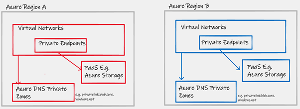 | 
|:--:| 
| Figure 1 - Regional Azure DNS Private Zones |

-	For each Azure PaaS service (E.g. Azure Storage) you have an Azure DNS Private Zone per region. Two regions = Two Azure DNS Private Zones for Azure Storage, Two Azure DNS Private Zones for Azure SQL, etc
-	These regional Azure DNS Private Zones are linked to the Hub Virtual Networks (or whatever VNet contains your centralised DNS servers) in each region

## 3.2. Design considerations

### 3.2.1. Optimal use of Azure Private Link / SDN

The use of regional specific Azure DNS Private Zones allows multiple A records (across your global common Layer-3 routing domain) for a single PaaS service (an endpoint with the same FQDN). This ensures that your traffic destined for an Azure PaaS service always makes the most optimal use of the Azure SDN with Azure Private Link. Private Link is capable of [global](https://docs.microsoft.com/en-gb/azure/private-link/private-link-overview#:~:text=data%20leakage%20risks.-,Global%20reach,-%3A%20Connect%20privately%20to) transport by default; Private Endpoints in Region X can access PaaS resources in Region Y, with the communications between X and Y being handled transparently by the Microsoft platform.

E.g. In the diagram below, a Virtual Machine in Region B is attempting to access a PaaS resource that happens to be located in Region A. By utilising a regional Azure DNS Private Zone, and regional Private Endpoints, the A record that is returned represents an IP address within the local region. This ensures ingress into Private Link as close to the source as possible. The section of the purple data path line that transits between Azure Regions is then entirely handled by the underlying Azure platform, with no dependencies on the customer-managed routing domain or private network.

| 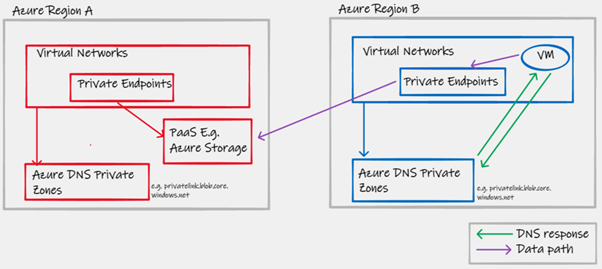 | 
|:--:| 
| Figure 2 - Inter-region PaaS access with regional Azure DNS Private Zones |

### 3.2.2. Seamless automated inter-region failover behaviour of all Azure PaaS services when using Private Link

The use of regional specific Azure DNS Private Zones allows seamless failover of all Azure PaaS services upon a complete regional outage. Seamless, in this case, is defined as “not requiring manual intervention. I.e. Failover behaviour for the service, when using Azure Private Link, remains the same as when using the service via its public interface. In the diagram below, let us consider an example scenario to highlight this behaviour;

-	The red Virtual Machine is configured to access a blob storage account test.blob.core.windows.net, and under normal conditions does so via its local Private Endpoint
-	You are also utilising Azure Site Recovery (ASR) to copy the VM’s to Region B
-	In a failure event, these VMs get re-inflated as Blue VMs in region B, and continue to use the same test.blob.core.windows.net FQDN for storage access
-	Using the Blue regional specific Azure DNS Private Zone, a local IP address is returned via a unique blue A record, directing traffic to the local Private Endpoint, which then provides seamless access to the same storage account (Which is now an LRS account hosted in Region B after failover, with the same primary FQDN for access)
-	User intervention into the Private Link or DNS configuration was not required to maintain a functional VM-to-PaaS datapath[^2]

[^2]: This assumes that you have pre-provisioned the required Private Endpoints (and associated A records in the Blue Azure DNS Private Zone) via automation, prior to the DR event. See 3.2.3.

| 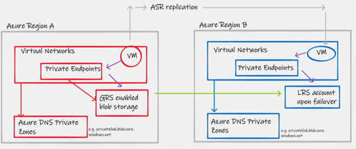 | 
|:--:| 
| Figure 3 - Azure Storage failover PaaS access with regional Azure DNS Private Zones |

This "hands off" approach to DNS logic upon regional failover also applies to all other Azure PaaS services, including those such as Azure SQL and Azure service bus that make use of Public DNS alias records with features such as [failover groups](https://docs.microsoft.com/en-us/azure/azure-sql/database/auto-failover-group-configure-sql-db?tabs=azure-portal&pivots=azure-sql-single-db#use-private-link).

### 3.2.3. Azure DNS Private Zone management and automation

This approach, the use of regional zones, will result in multiple Azure DNS Private Zone resources _with the same name_, this can be confusing if unaware of the context. (E.g. see below portal view in screenshot below).  To mitigate this, ensure proper use of Resource Group names to distinguish locale/region of the Private DNS Zone.

| 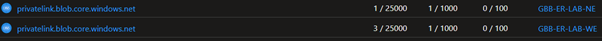| 
|:--:| 
| Figure 4 - Multiple privatelink.blob.core.windows.net Azure Private DNS Zones within the same portal view, note differing resource group names in column 4 |

Secondly, if using pre-existing custom-built automation (or [Enterprise scale provided Azure Policy](https://docs.microsoft.com/en-us/azure/cloud-adoption-framework/ready/azure-best-practices/private-link-and-dns-integration-at-scale) [^3] ) to configure Azure DNS Private zones upon Private Endpoint creation, you may need to modify your code to support an operator to make your code Resource Zone specific. I.e. If you only specify the Azure DNS Private Zone name, this will not be specific enough, if you have multiple Azure DNS Private Zones with the same name.

[^3]: The team within Microsoft responsible for Enterprise Scale Landing Zones documentation are currently working on updating the automation associated with this topic to provide flexibility in its deployment, to cater for both architecture options presented in this article.

### 3.2.4. Hybrid Private Link connectivity can be sub-optimal

This approach, the use of regional zones, ultimately allows differing A records (across your global common Layer-3 routing domain) to be returned for the same FQDN, depending on which region returns the query. This makes complete sense, and enables the "in Azure" optimal use of Private Link as laid out in section 3.2.1. 

However, when integrating [conditional forward from On-Premises](https://docs.microsoft.com/en-us/azure/private-link/private-endpoint-dns#on-premises-workloads-using-a-dns-forwarder) for Azure Private Link, we have to consider how this design has the potential to introduce sub-optimal routing. This ultimately boils down to which platform you are using for DNS infrastructure (E.g. Windows behaves differently to the latest BIND based software), checkout Appendix A on hybrid forwarding to fully understand this topic.

# 4. Architecture Option 2 – Single Global Azure DNS Private Zone (attached to all Azure Regions)

## 4.1. Overview

| 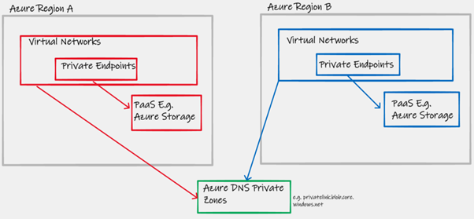| 
|:--:| 
| Figure 5 - Global Azure DNS Private Zone |

-	For each Azure PaaS service (E.g. Azure Storage) you have a single global Azure DNS Private Zone that is linked to your VNets in all regions. Two regions = one Azure DNS Private Zones for Azure Storage, one Azure DNS Private Zones for Azure SQL, etc
-	This global Azure DNS Private Zone is linked to the Hub Virtual Networks (or whatever VNet contains your centralised DNS servers) in all regions

## 4.2. Design considerations

### 4.2.1. Sub-Optimal use of Azure Private Link / SDN

In the diagram below, showing the DNS and datapath in a scenario that uses a common global Azure DNS Private Zone. Notice how the datapath between Azure regions relies on the customer's existing inter-region routing solution E.g. ExpressRoute transit or Global VNet Peering. 

With this design, data between the source/client and the Private Endpoint will rely more heavily on the Layer-3 routing provided by the customer's overlay Virtual Networking. This will increase cost and decrease performance and reliability, due to introducing additional hops made-up of customer specific components such as VNet Peering, ExpressRoute Circuits, ExpressRoute Gateways, NVAs and Routing/Security intent (NSG/UDR).

| 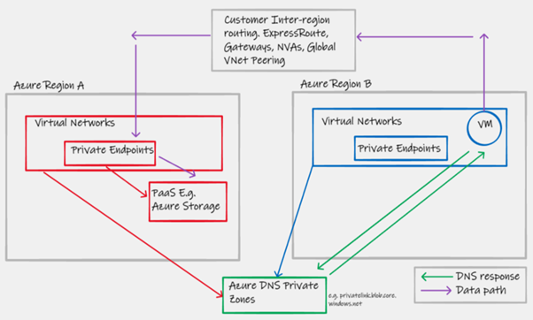 | 
|:--:| 
| Figure 6 - Inter-region PaaS access with global Azure DNS Private Zone |

### 4.2.2. Manual DNS intervention required for inter-region failover of some Azure PaaS services when using Private Link

The use of a common global Azure DNS Private Zone presents a challenge when working with the failover behaviour of Azure Storage. In the below diagram, please consider the following scenario.

-	The red Virtual Machine is configured to access a blob storage account test.blob.core.windows.net, and under normal conditions does so via its local Private Endpoint
-	You are also utilising Azure Site Recovery (ASR) to copy the VM’s to Region B
-	In a failure event, these VMs get re-inflated as Blue VMs in region B, and continue to use the same test.blob.core.windows.net FQDN for storage access
-	Using the green global Azure DNS Private Zone, a **remote** IP address is returned from a common A record, directing traffic to the **remote** Private Endpoint.This not only results in sub-optimal traffic flow (see section 2.2.1), but also a datapath that is now broken if Region A is offline/unavailable
-	User intervention (or complicated DR run-books)are required to change the global Azure DNS zone configuration to re-point the A records at the Blue Private Endpoints in order to reestablish the datapath to Azure Storage

| 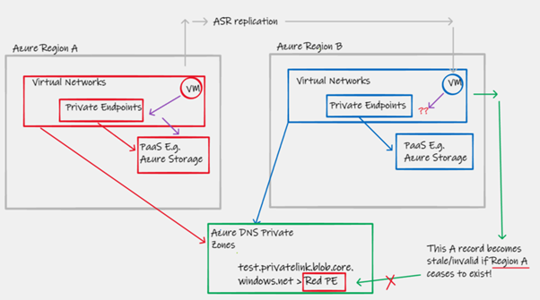 | 
|:--:| 
| Figure 7 - Azure Storage failover PaaS access with global Azure DNS Private Zone |

### 4.2.3. Hybrid Private Link connectivity always optimal

This approach, the use of a single global Azure DNS private zone, ultimately allows returns the same A record (across your global common Layer-3 routing domain) for the same FQDN, regardless of which region returns the query. This makes can result in sub-optimal "in Azure" use of Private Link / SDN as laid out in section 4.2.1. 

However, when integrating [conditional forward from On-Premises](https://docs.microsoft.com/en-us/azure/private-link/private-endpoint-dns#on-premises-workloads-using-a-dns-forwarder) for Azure Private Link, the single zone model does have benefits, wherein regardless of which platform you are using for DNS infrastructure (E.g. Windows behaves differently to the latest BIND based software), Private Link connectivity from On-Premises will always take the shortest network path. Checkout Appendix A on hybrid forwarding to fully understand this topic.

# 5. Conclusion

This document highlights that there is a key design decision to be made at the intersection of DNS design and use of the Azure Private Link technology; do I use a single global Azure Private DNS Zone, or do I use one per region?

The conclusion is that, whilst both designs are viable and functional, they do have differing characteristics that can effect both day-to-day BAU performance as well as the expected behaviour and associated RTO during a DR event. Which design is correct for your organisation will depend on many factors including IaaC-maturity and Global Scale level. 

However, the main decision pivot is Complexity vs RTO, for a lot of customers, the single zone model will be perfectly acceptable (They are willing to accept a DR run-book that takes hours to complete, if it only needs using during a catastrophic failure aka region-down), where-as other customers will want to do as much as possible to ensure the DR process is automated. The table below attempts to summarise the pros/cons of each approach.

  | - | Optimal Private Link SDN traffic flows  | Seamless BCDR of all PaaS service connectivity during "region down" event |  Optimal Hybrid forwarding | Automation complexity |
  | ------------- | ------------- |   ------------- | ------------ | ------------ |
  | Architecture Option 1 – Azure DNS Private Zone per Azure Region  | Yes  |   Yes (low RTO)  | Maybe (see Appendix A)|   High |
  | Architecture Option 2 – Single Global Azure DNS Private Zone (attached to all Azure Regions)  | No |   No (High RTO) | Yes | Low |

## 5.1. Note! Azure DNS Private Zones are a global resource

The benefits highlighted by "regional split brain" use of Azure Private DNS Zones for Azure Private link, are **not** a recommendation to abandon/forget the Global nature  Azure DNS Private Zones as an Azure resource in their entirety. In fact, for your own services (where you are using Azure DNS Private Zones for an internal forward lookup zone) the right approach _is_ normally to use a global zone. This is because, normally, the IP address (A record) returned by DNS, represents the destination of the service you are trying to access. The reason this fundamentally differs for Azure Private Link, is  that the IP address (A record) returned by DNS represents only the location of the Private Endpoint (PE), _not_ the destination/location of the finale PaaS service to be accessed.

# 6. Appendix A - Hybrid forwarding and multi-region Private Link considerations when accessing from On-Premises

## 6.1. Baseline topology and Windows/BIND differences

Let us first consider a typical resilient hybrid DNS forwarding design for an Enterprise customer with multiple On-Premises locations, and multiple Azure regions.

| 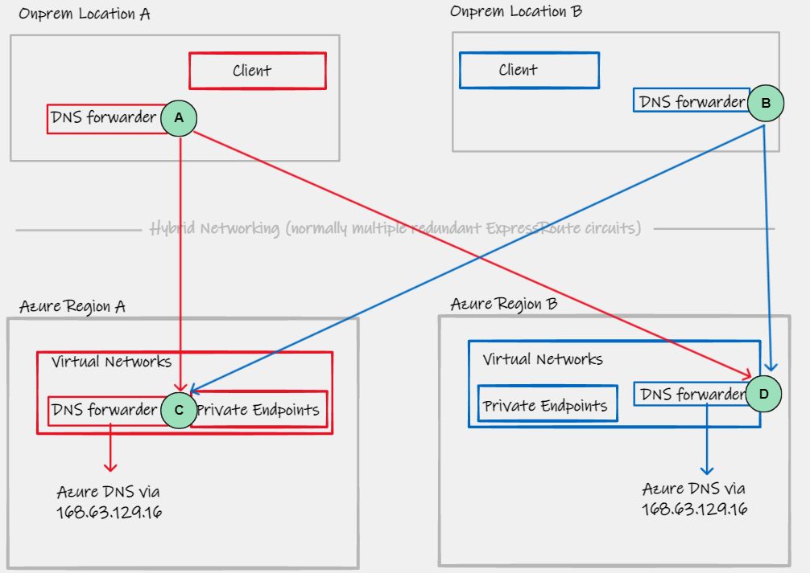 | 
|:--:| 
| Figure 8 - Resilient hybrid DNS forwarding |

- A/B/C/D represent DNS forwarding functions, logically drawn as one box, in reality even these individual components will be resilient (pairs of DNS servers)
- A typical forwarding configuration of A will often simply say "For an FQDN that lives in Azure, forward to C and D, with C being specified first in the list of forwarders. How A processes this list of forwarders, depends on the DNS software being used:
  - Microsoft Windows Servers running the DNS service, [will always](https://docs.microsoft.com/en-us/troubleshoot/windows-server/networking/forwarders-resolution-timeouts#what-is-the-default-behavior-of-a-dns-server-when-more-than-two-dns-servers-are-configured-as-conditional-forwarders) use the first forwarder in the list (always send to C in our example). 
  - Older versions of BIND will exhibit the same behaviour as Windows
  - Modern versions of BIND (v9) implement a different algorithm in choosing the forwarders; they use an RTT/latency smoothing based behaviour. Long story short, is that in our example, **even if you put C first in your forwarders list, and C remains healthy, D will infrequently be used**
  - Infoblox, based on the latest BIND code, therefore exhibits the same behaviour - more info [here](https://community.infoblox.com/t5/nios-dns-dhcp-ipam/how-does-infoblox-select-forwarders/td-p/19945#:~:text=06%3A49%20AM-,Hello%20there%2C,-While%20using%20more)

_This differing behaviour has implications for our wider multi-region DNS integration and access to Azure Private Link. In short, if you are using Windows DNS (E.g. Active Directory integrated, replicated or manual forwarders between DC onprem>Azure), then you have nothing to consider. If you are using BINDv9 or Infoblox (or other BIND based solutions), then the regional zone model can cause issues. Let's explore why..._

## 6.2. Hybrid Private Link access with Architecture Option 1 – Azure DNS Private Zone per Azure Region

With the regional zone model, if A forwards to C, then the DNS A-record returned is that of a Private Endpoint in Region A. Therefore OnPrem location A, sends the traffic to Azure Region A, and assuming A<>A is shorter than A<>B, this traffic gets the lowest possible latency.

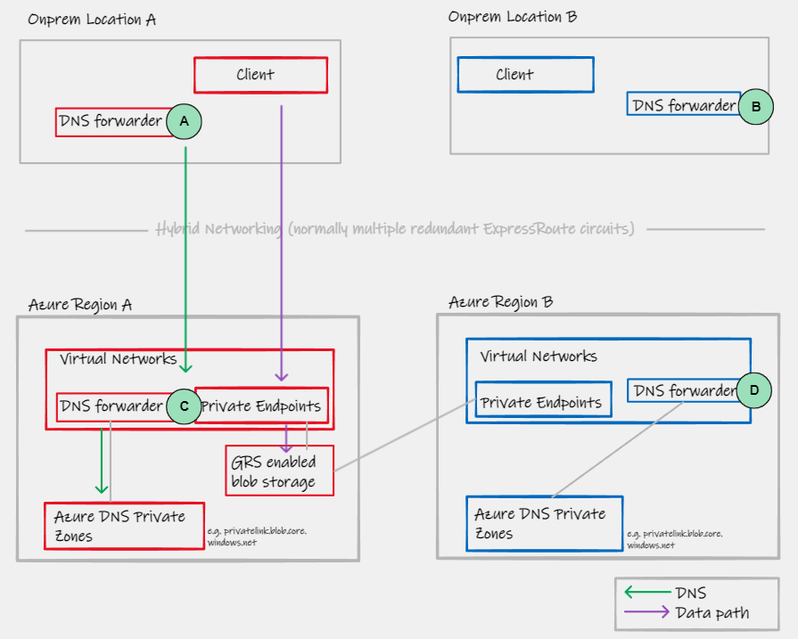

As stated before, if you are running DNS on top of Windows Servers then A will always forward to C if its available, therefore no issues. However, with later versions of BIND (and Infoblox for example), we know now that sometimes A will forward to D, and that results in sub-optimal data-path as shown in the diagram below.

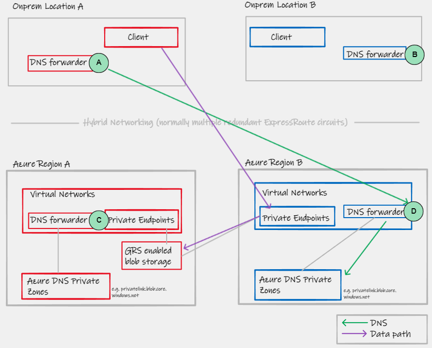

> :warning:#1:warning: How much of a concern / problem this is for your network, largely depends on the application (or PaaS service) that is being accessed, the bandwidth requirements, and the relative geographical location of A/B/C/D. For example if we are talking about low bandwidth access within a topology that is using Azure regions UK South + UK West, combined with two customers locations in the UK, the longer path, whilst being suboptimal, may not be problematic. However, if we are talking about a design requiring 1Gbps+ constant access to an Azure Storage account, and the topology includes regions/locations on opposites coasts of the USA, then this could be problematic due to increased latency affecting performance. 

> :warning:#2:warning: An important implication of this design is that both your red and blue regions, need Private Endpoints **and** Azure DNS Private Zone entries for **all** red **and** blue PaaS services. Why? If A forward to D, despite D being in Blue, it must have an answer for FQDN/endpoints that live in Red, otherwise you will get NXDOMAIN and break your On-Prem > Azure PL connectivity. This represents a large requirement to update existing automation; I.e. When provisioning Private Endpoints in Red/Blue, your automation must synchronize the intent across regions in the form of multiple PE + multiple Private-DNS zone entries.

###  6.2.1 Mitigation options

If you have opted for the regional Azure DNS Private Zone model, to obtain the benefits summarised in section 5, what are then your options to mitigate the possible suboptimal Hybrid forwarding if you are a customer using later version of BIND or Infoblox. **Again, I repeat that this is not a consideration for Windows Server customers**.

- One approach is to specify only a single region in your On-Premises forwarding config. I.e. A would only point to C under normal conditions. This would then create a requirement to manually switch the forwarder to D, in a DR event. This would probably not be acceptable for most Enterprises opting for the regional zone model, as it goes against the principal of automatic failover
- Accept that even in BAU, some flows will be suboptimal, see note above about geographical location relevance
- Investigate customer DNS forwarding logic. E.g. Infoblox have [DNS Traffic Control](https://docs.infoblox.com/space/NAG8/22252156/About+DNS+Traffic+Control) that may be able to force forwarding logic
- Rather than specifying multiple (C and D) on A, rather utilise a [multi-region Private Load balancer solution](https://github.com/adstuart/azure-crossregion-private-l), to represent your DNS infrastructure as a single IP address. Therein relying on network level routing for failover, rather than DNS server infrastructure and TTL. An example of this is Infoblox Anycast integration which can be used with Azure Router Server to advertise a common "In cloud" DNS endpoint to On-Premises. 

## 6.3. Hybrid Private Link access with Architecture Option 2 – Single Global Azure DNS Private Zone (attached to all Azure Regions)

For completeness, lets show why the single global zone means we do **not** have to consider this sub-optimal hybrid routing, even with the latest BIND/Infoblox based DNS infrastructure.

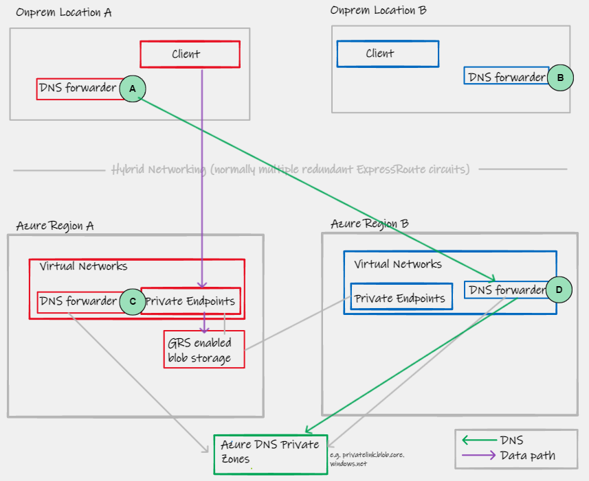

With a single global Azure DNS Private Zone, even if A forwards to D (due to the RTT algorithm of some DNS software) **because we are using a single common Azure DNS Global Zone, which will only contain an A record within region A, even though the DNS request is sent to region B, then actual datapath and network connectivity to the Private Endpoint is still optimally sent to region A.**

# 7. Contributors

Many internal Microsoft FTE were consulted during not only the creation of this document, but the simple observation that a discussion on this topic was needed. In fact, there was probably over 30 such conversations, and any effort to name everyone, would no doubt miss someones valuable input. Therefore I would like to thank all colleagues in GBB, CSU, CAE, FastTrack and the Product Groups for their support with this work.

